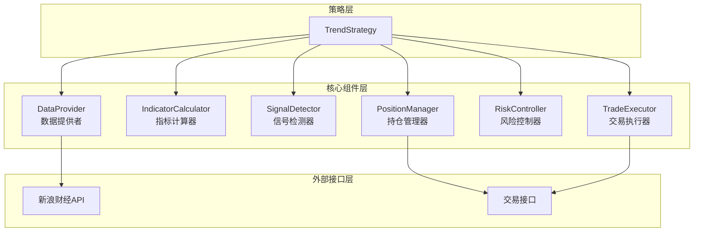

# 设计文档

## 概述

A股趋势跟踪策略系统是一个模块化的量化交易框架，采用分层架构设计，将数据获取、信号生成、风险控制和交易执行等功能解耦。系统支持多种技术指标、多重信号确认、动态仓位管理和自适应参数优化，能够适应不同的市场环境。

### 设计目标

1. **模块化**: 各组件职责单一，易于测试和维护
2. **可扩展**: 支持添加新的技术指标和策略逻辑
3. **可配置**: 所有参数可通过配置文件调整
4. **稳定性**: 完善的错误处理和恢复机制
5. **性能**: 高效的数据处理和计算
6. **可测试**: 支持回测和模拟交易

### 核心特性

- 基于双均线交叉的趋势识别
- 支持MACD、RSI、布林带、ATR、ADX等多种技术指标
- 多重信号确认机制减少虚假信号
- 动态仓位管理和风险控制
- 自适应参数优化
- 多品种组合管理
- 完整的回测功能，包含滑点和交易成本模拟

## 架构

### 系统架构图



### 分层架构

1. **策略层**: 协调各组件，实现策略主循环
2. **核心组件层**: 提供数据、计算、信号、风险、交易等功能
3. **外部接口层**: 与外部系统交互（数据源、交易接口）


## 组件和接口

### 1. DataProvider (数据提供者)

负责从外部数据源获取K线数据和市场信息。

#### 接口

```python
class DataProvider:
    def __init__(self, config: Dict):
        """初始化数据提供者"""
        
    def convert_symbol(self, ts_code: str) -> str:
        """
        转换股票代码格式
        参数: ts_code - Tushare格式代码 (如 000001.SZ)
        返回: 新浪格式代码 (如 sz000001)
        """
        
    def fetch_kline(self, symbol: str, scale: int, datalen: int) -> List[KlineData]:
        """
        获取K线数据
        参数:
            symbol - 股票代码（新浪格式）
            scale - K线周期（5/15/30/60/240分钟）
            datalen - 数据长度
        返回: K线数据列表
        异常: DataFetchError - 数据获取失败
        """
        
    def fetch_realtime_price(self, symbol: str) -> float:
        """
        获取实时价格
        参数: symbol - 股票代码
        返回: 当前价格
        """
```

#### 数据结构

```python
@dataclass
class KlineData:
    timestamp: datetime
    open: float
    high: float
    low: float
    close: float
    volume: float
```

### 2. IndicatorCalculator (指标计算器)

负责计算各种技术指标。

#### 接口

```python
class IndicatorCalculator:
    @staticmethod
    def calculate_ma(data: List[float], window: int) -> Optional[float]:
        """
        计算简单移动平均线
        参数:
            data - 价格序列
            window - 窗口大小
        返回: 均线值，数据不足返回None
        """
        
    @staticmethod
    def calculate_ema(data: List[float], window: int) -> Optional[float]:
        """
        计算指数移动平均线
        参数:
            data - 价格序列
            window - 窗口大小
        返回: EMA值
        """
        
    @staticmethod
    def calculate_macd(data: List[float], 
                      fast: int = 12, 
                      slow: int = 26, 
                      signal: int = 9) -> Optional[MACDResult]:
        """
        计算MACD指标
        参数:
            data - 价格序列
            fast - 快线周期
            slow - 慢线周期
            signal - 信号线周期
        返回: MACD结果（DIF、DEA、柱状图）
        """
        
    @staticmethod
    def calculate_rsi(data: List[float], window: int = 14) -> Optional[float]:
        """
        计算RSI指标
        参数:
            data - 价格序列
            window - 窗口大小
        返回: RSI值（0-100）
        """
        
    @staticmethod
    def calculate_bollinger_bands(data: List[float], 
                                  window: int = 20, 
                                  std_dev: float = 2.0) -> Optional[BollingerBands]:
        """
        计算布林带
        参数:
            data - 价格序列
            window - 窗口大小
            std_dev - 标准差倍数
        返回: 布林带（上轨、中轨、下轨）
        """
        
    @staticmethod
    def calculate_atr(klines: List[KlineData], window: int = 14) -> Optional[float]:
        """
        计算ATR（平均真实波动范围）
        参数:
            klines - K线数据
            window - 窗口大小
        返回: ATR值
        """
        
    @staticmethod
    def calculate_adx(klines: List[KlineData], window: int = 14) -> Optional[float]:
        """
        计算ADX（平均趋向指标）
        参数:
            klines - K线数据
            window - 窗口大小
        返回: ADX值（0-100）
        """
```

#### 数据结构

```python
@dataclass
class MACDResult:
    dif: float      # MACD线（快线-慢线）
    dea: float      # 信号线（DIF的EMA）
    histogram: float # 柱状图（DIF-DEA）

@dataclass
class BollingerBands:
    upper: float    # 上轨
    middle: float   # 中轨（MA）
    lower: float    # 下轨
```


### 3. SignalDetector (信号检测器)

负责检测交易信号，支持多重确认机制。

#### 接口

```python
class SignalDetector:
    def __init__(self, config: SignalConfig):
        """初始化信号检测器"""
        
    def detect_ma_cross(self, 
                       short_ma: float, 
                       long_ma: float,
                       prev_short_ma: float,
                       prev_long_ma: float) -> Tuple[bool, bool]:
        """
        检测均线交叉信号
        参数:
            short_ma - 当前短期均线
            long_ma - 当前长期均线
            prev_short_ma - 前一周期短期均线
            prev_long_ma - 前一周期长期均线
        返回: (金叉, 死叉)
        """
        
    def detect_macd_signal(self, 
                          macd: MACDResult,
                          prev_macd: MACDResult) -> Tuple[bool, bool]:
        """
        检测MACD信号
        参数:
            macd - 当前MACD
            prev_macd - 前一周期MACD
        返回: (买入信号, 卖出信号)
        """
        
    def check_rsi_condition(self, 
                           rsi: float,
                           signal_type: str) -> bool:
        """
        检查RSI条件
        参数:
            rsi - RSI值
            signal_type - 'buy' 或 'sell'
        返回: 是否满足条件
        """
        
    def check_volume_confirmation(self,
                                 current_volume: float,
                                 avg_volume: float,
                                 threshold: float = 1.2) -> bool:
        """
        检查成交量确认
        参数:
            current_volume - 当前成交量
            avg_volume - 平均成交量
            threshold - 放大倍数阈值
        返回: 是否放量
        """
        
    def generate_signal(self, 
                       indicators: Dict[str, Any],
                       prev_indicators: Dict[str, Any]) -> Signal:
        """
        综合生成交易信号
        参数:
            indicators - 当前指标字典
            prev_indicators - 前一周期指标字典
        返回: 交易信号
        """
```

#### 数据结构

```python
@dataclass
class SignalConfig:
    enable_macd: bool = False
    enable_rsi: bool = False
    enable_bollinger: bool = False
    enable_volume_confirm: bool = False
    enable_adx_filter: bool = False
    rsi_oversold: float = 30.0
    rsi_overbought: float = 70.0
    adx_threshold: float = 25.0
    min_confirmations: int = 1  # 最小确认指标数

@dataclass
class Signal:
    action: str  # 'buy', 'sell', 'hold'
    strength: float  # 信号强度 0-1
    reasons: List[str]  # 信号原因列表
    timestamp: datetime
```

### 4. PositionManager (持仓管理器)

负责管理持仓状态和同步实际持仓。

#### 接口

```python
class PositionManager:
    def __init__(self, trader: Optional[QuantTrader] = None):
        """初始化持仓管理器"""
        
    def sync_position(self, stock_code: str) -> Optional[Position]:
        """
        同步持仓信息
        参数: stock_code - 股票代码
        返回: 持仓信息，无持仓返回None
        """
        
    def update_position(self, 
                       stock_code: str,
                       action: str,
                       price: float,
                       quantity: int):
        """
        更新持仓状态
        参数:
            stock_code - 股票代码
            action - 'buy' 或 'sell'
            price - 成交价格
            quantity - 成交数量
        """
        
    def get_position(self, stock_code: str) -> Optional[Position]:
        """
        获取持仓信息
        参数: stock_code - 股票代码
        返回: 持仓信息
        """
        
    def is_holding(self, stock_code: str) -> bool:
        """
        检查是否持仓
        参数: stock_code - 股票代码
        返回: 是否持仓
        """
        
    def get_profit_ratio(self, stock_code: str, current_price: float) -> float:
        """
        计算盈亏比例
        参数:
            stock_code - 股票代码
            current_price - 当前价格
        返回: 盈亏比例
        """
```

#### 数据结构

```python
@dataclass
class Position:
    stock_code: str
    quantity: int
    entry_price: float
    entry_time: datetime
    current_price: float
    profit_ratio: float
```


### 5. RiskController (风险控制器)

负责风险管理，包括止损止盈、仓位控制等。

#### 接口

```python
class RiskController:
    def __init__(self, config: RiskConfig):
        """初始化风险控制器"""
        
    def check_stop_loss(self, 
                       position: Position,
                       current_price: float) -> Tuple[bool, str]:
        """
        检查止损条件
        参数:
            position - 持仓信息
            current_price - 当前价格
        返回: (是否触发, 原因)
        """
        
    def check_take_profit(self,
                         position: Position,
                         current_price: float) -> Tuple[bool, str]:
        """
        检查止盈条件
        参数:
            position - 持仓信息
            current_price - 当前价格
        返回: (是否触发, 原因)
        """
        
    def calculate_position_size(self,
                               account_balance: float,
                               current_price: float,
                               atr: Optional[float] = None) -> int:
        """
        计算仓位大小
        参数:
            account_balance - 账户余额
            current_price - 当前价格
            atr - ATR值（用于动态仓位）
        返回: 交易数量（股）
        """
        
    def calculate_dynamic_stop_loss(self,
                                   entry_price: float,
                                   atr: float,
                                   multiplier: float = 2.0) -> float:
        """
        计算动态止损价格
        参数:
            entry_price - 入场价格
            atr - ATR值
            multiplier - ATR倍数
        返回: 止损价格
        """
        
    def check_portfolio_risk(self,
                            positions: List[Position],
                            account_balance: float) -> bool:
        """
        检查组合风险
        参数:
            positions - 所有持仓
            account_balance - 账户余额
        返回: 是否超过风险限制
        """
```

#### 数据结构

```python
@dataclass
class RiskConfig:
    stop_loss_ratio: float = 0.0  # 固定止损比例
    take_profit_ratio: float = 0.0  # 固定止盈比例
    use_dynamic_stop: bool = False  # 使用动态止损
    atr_multiplier: float = 2.0  # ATR倍数
    max_position_ratio: float = 0.1  # 单个持仓最大占比
    max_total_position_ratio: float = 0.8  # 总持仓最大占比
    use_kelly_criterion: bool = False  # 使用凯利公式
    use_fixed_risk: bool = False  # 使用固定风险比例
    risk_per_trade: float = 0.02  # 单次交易风险比例
```

### 6. TradeExecutor (交易执行器)

负责执行交易操作，支持实盘和模拟交易。

#### 接口

```python
class TradeExecutor:
    def __init__(self, 
                 trader: Optional[QuantTrader] = None,
                 mode: str = 'live'):
        """
        初始化交易执行器
        参数:
            trader - 交易接口
            mode - 'live' 或 'backtest'
        """
        
    def execute_buy(self,
                   stock_code: str,
                   price: float,
                   quantity: int) -> TradeResult:
        """
        执行买入
        参数:
            stock_code - 股票代码
            price - 买入价格
            quantity - 买入数量
        返回: 交易结果
        """
        
    def execute_sell(self,
                    stock_code: str,
                    price: float,
                    quantity: int,
                    reason: str) -> TradeResult:
        """
        执行卖出
        参数:
            stock_code - 股票代码
            price - 卖出价格
            quantity - 卖出数量
            reason - 卖出原因
        返回: 交易结果
        """
        
    def calculate_slippage(self, 
                          price: float,
                          action: str) -> float:
        """
        计算滑点
        参数:
            price - 原始价格
            action - 'buy' 或 'sell'
        返回: 调整后价格
        """
        
    def calculate_commission(self,
                           price: float,
                           quantity: int) -> float:
        """
        计算佣金
        参数:
            price - 成交价格
            quantity - 成交数量
        返回: 佣金金额
        """
        
    def calculate_stamp_tax(self,
                          price: float,
                          quantity: int) -> float:
        """
        计算印花税（仅卖出）
        参数:
            price - 成交价格
            quantity - 成交数量
        返回: 印花税金额
        """
```

#### 数据结构

```python
@dataclass
class TradeResult:
    success: bool
    stock_code: str
    action: str
    price: float
    quantity: int
    commission: float
    stamp_tax: float
    total_cost: float
    timestamp: datetime
    error_message: Optional[str] = None
```


### 7. TrendStrategy (策略主类)

协调所有组件，实现策略主循环。

#### 接口

```python
class TrendStrategy(BaseStrategy):
    def __init__(self, data: Dict, log_callback=None):
        """初始化策略"""
        
    def initialize(self):
        """初始化所有组件"""
        
    def run(self):
        """策略主循环"""
        
    def on_tick(self):
        """每个周期的处理逻辑"""
        
    def handle_buy_signal(self, signal: Signal, price: float):
        """处理买入信号"""
        
    def handle_sell_signal(self, signal: Signal, price: float):
        """处理卖出信号"""
        
    def update_indicators(self, klines: List[KlineData]) -> Dict[str, Any]:
        """更新所有技术指标"""
        
    def log_status(self, indicators: Dict[str, Any], position: Optional[Position]):
        """记录当前状态"""
```

## 数据模型

### 配置模型

```python
@dataclass
class StrategyConfig:
    # 基础配置
    stock_code: str
    short_window: int = 5
    long_window: int = 20
    timeframe: int = 240  # K线周期（分钟）
    interval: int = 60  # 轮询间隔（秒）
    
    # 信号配置
    signal_config: SignalConfig = field(default_factory=SignalConfig)
    
    # 风险配置
    risk_config: RiskConfig = field(default_factory=RiskConfig)
    
    # 回测配置
    backtest_mode: bool = False
    slippage_ratio: float = 0.001  # 滑点比例
    commission_rate: float = 0.0003  # 佣金率
    stamp_tax_rate: float = 0.001  # 印花税率
    
    # 高级功能
    enable_adaptive_params: bool = False
    enable_multi_stock: bool = False
    stock_list: List[str] = field(default_factory=list)
```

### 回测结果模型

```python
@dataclass
class BacktestResult:
    # 基本信息
    start_date: datetime
    end_date: datetime
    initial_capital: float
    final_capital: float
    
    # 收益指标
    total_return: float  # 总收益率
    annual_return: float  # 年化收益率
    max_drawdown: float  # 最大回撤
    sharpe_ratio: float  # 夏普比率
    
    # 交易统计
    total_trades: int  # 总交易次数
    winning_trades: int  # 盈利交易次数
    losing_trades: int  # 亏损交易次数
    win_rate: float  # 胜率
    avg_profit: float  # 平均盈利
    avg_loss: float  # 平均亏损
    profit_factor: float  # 盈亏比
    
    # 成本统计
    total_commission: float  # 总佣金
    total_stamp_tax: float  # 总印花税
    total_slippage: float  # 总滑点成本
    
    # 交易记录
    trades: List[TradeResult]
    equity_curve: List[Tuple[datetime, float]]  # 资金曲线
```


## 正确性属性

属性是一个特征或行为，应该在系统的所有有效执行中保持为真——本质上是关于系统应该做什么的形式化陈述。属性作为人类可读规范和机器可验证正确性保证之间的桥梁。

### 配置和参数验证属性

**属性 1: 配置参数正确解析**
*对于任何*有效的配置字典，系统应该能够正确解析所有策略参数（短期窗口、长期窗口、交易数量、止损比例、止盈比例、K线周期、轮询间隔），并使用配置值或默认值。
**验证需求: 1.1, 1.2, 1.3, 1.4, 1.5, 1.6, 1.7**

**属性 2: 无效窗口参数自动修正**
*对于任何*短期窗口大于等于长期窗口的配置，系统应该将参数重置为默认值（5/20）并记录警告日志。
**验证需求: 1.8**

**属性 3: 最小交易单位验证**
*对于任何*小于100股的交易数量配置，系统应该将其调整为100股并记录警告日志。
**验证需求: 1.9**

**属性 4: 交易数量为100的整数倍**
*对于任何*交易操作，实际执行的交易数量应该是100的整数倍，符合A股市场规则。
**验证需求: 11.7**

### 数据获取和转换属性

**属性 5: 股票代码格式转换正确性**
*对于任何*有效的Tushare格式股票代码（如000001.SZ或600519.SH），系统应该能够正确转换为新浪财经格式（如sz000001或sh600519）。
**验证需求: 2.1, 11.3, 11.4, 11.5**

**属性 6: API失败时返回空列表**
*对于任何*导致API请求失败的情况（网络错误、超时、无效响应），数据提供者应该记录错误日志并返回空列表，而不是抛出未捕获的异常。
**验证需求: 2.4, 2.5, 2.6**

### 技术指标计算属性

**属性 7: 简单移动平均线计算正确性**
*对于任何*长度大于等于窗口大小的价格序列，计算的SMA应该等于最近N个价格的算术平均值。
**验证需求: 3.1, 3.3**

**属性 8: 指标计算的幂等性**
*对于任何*价格序列，多次计算同一指标应该返回相同的结果。
**验证需求: 3.1**

**属性 9: MACD计算的一致性**
*对于任何*价格序列，MACD的柱状图应该等于DIF减去DEA。
**验证需求: 13.1**

### 信号检测属性

**属性 10: 金叉信号检测正确性**
*对于任何*均线序列，当且仅当前一周期短期均线小于等于长期均线且当前周期短期均线大于长期均线时，应该检测到金叉信号。
**验证需求: 4.1**

**属性 11: 死叉信号检测正确性**
*对于任何*均线序列，当且仅当前一周期短期均线大于等于长期均线且当前周期短期均线小于长期均线时，应该检测到死叉信号。
**验证需求: 4.2**

**属性 12: 信号互斥性**
*对于任何*均线序列，金叉和死叉信号不应该同时出现。
**验证需求: 4.1, 4.2, 4.3**

**属性 13: MACD信号检测正确性**
*对于任何*MACD序列，当MACD线上穿信号线时应该生成买入信号，当MACD线下穿信号线时应该生成卖出信号。
**验证需求: 13.2, 13.3**

**属性 14: RSI状态判断正确性**
*对于任何*RSI值，当RSI低于超卖阈值时应该标记为超卖状态，当RSI高于超买阈值时应该标记为超买状态。
**验证需求: 13.5, 13.6**

**属性 15: 多重信号确认逻辑**
*对于任何*启用多重确认的配置，只有当所有启用的指标都满足买入（或卖出）条件时，才应该生成最终的交易信号。
**验证需求: 14.1, 14.2**


### 持仓管理属性

**属性 16: 持仓状态一致性**
*对于任何*持仓数量，当数量大于0时持仓状态应该为已持仓，当数量等于0时持仓状态应该为未持仓。
**验证需求: 5.3, 5.5**

**属性 17: 盈亏比例计算正确性**
*对于任何*持仓和当前价格，盈亏比例应该等于（当前价格 - 入场价格）/ 入场价格。
**验证需求: 6.2**

**属性 18: 多品种持仓独立性**
*对于任何*多品种策略，每个股票的持仓状态应该独立维护，一个股票的交易不应该影响其他股票的持仓状态。
**验证需求: 17.2, 17.3, 17.4**

### 风险控制属性

**属性 19: 止损触发正确性**
*对于任何*持仓，当亏损比例超过设定的止损比例时，风险控制器应该触发止损信号。
**验证需求: 6.3**

**属性 20: 止盈触发正确性**
*对于任何*持仓，当盈利比例超过设定的止盈比例时，风险控制器应该触发止盈信号。
**验证需求: 6.4**

**属性 21: 仓位限制遵守**
*对于任何*交易，单次交易金额不应该超过账户总资金的配置比例（默认10%）。
**验证需求: 15.7**

**属性 22: 动态仓位与波动率反向关系**
*对于任何*启用动态仓位的配置，当市场波动率增加时，计算的仓位大小应该减少；当波动率减少时，仓位大小应该增加。
**验证需求: 15.2, 15.3, 15.4**

### 交易执行属性

**属性 23: 买入交易记录完整性**
*对于任何*买入操作，交易记录应该包含股票代码、买入价格、买入数量、买入时间和交易成本。
**验证需求: 7.2**

**属性 24: 卖出交易记录完整性**
*对于任何*卖出操作，交易记录应该包含股票代码、卖出价格、卖出数量、卖出原因、盈亏比例、卖出时间和交易成本。
**验证需求: 7.7**

**属性 25: 滑点计算方向正确性**
*对于任何*回测模式下的交易，买入时实际成交价格应该高于原始价格（增加滑点），卖出时实际成交价格应该低于原始价格（减少滑点）。
**验证需求: 18.3, 18.4**

**属性 26: 交易成本计算正确性**
*对于任何*交易，总成本应该等于佣金加上印花税（仅卖出）加上滑点成本。
**验证需求: 18.5, 18.6, 18.7**

### 策略执行属性

**属性 27: 未持仓时金叉买入**
*对于任何*未持仓状态，当检测到金叉信号时，策略应该执行买入操作。
**验证需求: 8.8**

**属性 28: 持仓时死叉卖出**
*对于任何*持仓状态，当检测到死叉信号时，策略应该执行卖出操作。
**验证需求: 8.9**

**属性 29: 持仓时止损止盈卖出**
*对于任何*持仓状态，当触发止损或止盈条件时，策略应该执行卖出操作。
**验证需求: 8.10**

**属性 30: 错误计数器递增**
*对于任何*策略执行过程中发生的异常，错误计数器应该增加1。
**验证需求: 9.2**

**属性 31: 错误阈值停止策略**
*对于任何*策略执行，当连续错误次数达到5次时，策略应该停止运行。
**验证需求: 9.3**

**属性 32: 成功执行重置错误计数**
*对于任何*成功完成的策略循环，错误计数器应该重置为0。
**验证需求: 9.4**

### 回测计算属性

**属性 33: 累计收益率计算正确性**
*对于任何*交易序列，累计收益率应该等于（最终资金 - 初始资金）/ 初始资金。
**验证需求: 12.5**

**属性 34: 最大回撤计算正确性**
*对于任何*资金曲线，最大回撤应该等于从任意峰值到后续最低谷值的最大跌幅百分比。
**验证需求: 12.6**

**属性 35: 胜率计算正确性**
*对于任何*交易序列，胜率应该等于盈利交易次数除以总交易次数。
**验证需求: 12.7**

**属性 36: 回测资金曲线单调性**
*对于任何*回测过程，资金曲线的每个点应该等于前一个点加上该周期的盈亏和成本。
**验证需求: 12.4, 12.5**

### 日志记录属性

**属性 37: 关键操作日志完整性**
*对于任何*买入或卖出操作，系统应该记录包含价格、数量、时间和原因的日志。
**验证需求: 10.4, 10.5**

**属性 38: 错误日志记录**
*对于任何*发生的异常或错误，系统应该记录ERROR级别的日志，包含错误信息和堆栈跟踪。
**验证需求: 10.8, 9.5**


## 错误处理

### 错误分类

1. **数据获取错误**
   - 网络连接失败
   - API超时
   - 数据格式错误
   - 处理方式: 记录错误日志，返回空数据，继续下一轮

2. **计算错误**
   - 数据不足无法计算指标
   - 数值计算异常（除零、溢出）
   - 处理方式: 返回None，跳过本轮交易信号

3. **交易执行错误**
   - 交易接口调用失败
   - 余额不足
   - 股票停牌
   - 处理方式: 记录错误日志，不更新持仓状态，继续监控

4. **配置错误**
   - 参数缺失或格式错误
   - 参数值超出合理范围
   - 处理方式: 使用默认值，记录警告日志

5. **系统错误**
   - 未预期的异常
   - 资源耗尽
   - 处理方式: 增加错误计数，达到阈值后停止策略

### 错误恢复机制

```python
class ErrorRecovery:
    def __init__(self, max_errors: int = 5):
        self.error_count = 0
        self.max_errors = max_errors
        self.last_error_time = None
        
    def on_error(self, error: Exception) -> bool:
        """
        处理错误
        返回: 是否应该继续运行
        """
        self.error_count += 1
        self.last_error_time = datetime.now()
        
        if self.error_count >= self.max_errors:
            return False  # 停止运行
        return True  # 继续运行
        
    def on_success(self):
        """成功执行后重置错误计数"""
        self.error_count = 0
```

### 异常处理策略

1. **网络异常**: 重试3次，间隔递增（1s, 2s, 4s）
2. **数据异常**: 跳过本轮，等待下一个周期
3. **交易异常**: 记录日志，不影响策略继续运行
4. **致命异常**: 立即停止策略，保存状态

## 测试策略

### 双重测试方法

本系统采用单元测试和基于属性的测试相结合的方法：

- **单元测试**: 验证特定示例、边界情况和错误条件
- **基于属性的测试**: 验证所有输入的通用属性

两者互补，共同提供全面的覆盖：单元测试捕获具体的错误，基于属性的测试验证一般正确性。

### 单元测试策略

单元测试应该专注于：

1. **具体示例**: 演示正确行为的特定案例
2. **边界条件**: 
   - 数据长度等于窗口大小
   - 数据长度小于窗口大小
   - 空数据列表
   - 价格为0或负数
3. **错误条件**:
   - API返回错误
   - 网络超时
   - 无效的配置参数
4. **集成点**: 组件之间的交互

避免编写过多的单元测试 - 基于属性的测试会处理大量输入的覆盖。

### 基于属性的测试策略

使用Python的`hypothesis`库进行基于属性的测试。

#### 配置要求

- 每个属性测试最少运行100次迭代（由于随机化）
- 每个测试必须引用其设计文档属性
- 标签格式: `# Feature: a-share-trend-strategy, Property {number}: {property_text}`
- 每个正确性属性必须由单个基于属性的测试实现

#### 测试示例

```python
from hypothesis import given, strategies as st
import pytest

# Feature: a-share-trend-strategy, Property 7: 简单移动平均线计算正确性
@given(
    prices=st.lists(st.floats(min_value=1.0, max_value=1000.0), min_size=20, max_size=100),
    window=st.integers(min_value=5, max_value=20)
)
@pytest.mark.property_test
def test_sma_calculation_correctness(prices, window):
    """
    对于任何长度大于等于窗口大小的价格序列，
    计算的SMA应该等于最近N个价格的算术平均值
    """
    calculator = IndicatorCalculator()
    sma = calculator.calculate_ma(prices, window)
    
    if len(prices) >= window:
        expected = sum(prices[-window:]) / window
        assert abs(sma - expected) < 0.0001
    else:
        assert sma is None

# Feature: a-share-trend-strategy, Property 10: 金叉信号检测正确性
@given(
    prev_short=st.floats(min_value=1.0, max_value=100.0),
    prev_long=st.floats(min_value=1.0, max_value=100.0),
    curr_short=st.floats(min_value=1.0, max_value=100.0),
    curr_long=st.floats(min_value=1.0, max_value=100.0)
)
@pytest.mark.property_test
def test_golden_cross_detection(prev_short, prev_long, curr_short, curr_long):
    """
    对于任何均线序列，当且仅当前一周期短期均线小于等于长期均线
    且当前周期短期均线大于长期均线时，应该检测到金叉信号
    """
    detector = SignalDetector(SignalConfig())
    golden, death = detector.detect_ma_cross(curr_short, curr_long, prev_short, prev_long)
    
    expected_golden = (prev_short <= prev_long) and (curr_short > curr_long)
    assert golden == expected_golden

# Feature: a-share-trend-strategy, Property 19: 止损触发正确性
@given(
    entry_price=st.floats(min_value=1.0, max_value=100.0),
    current_price=st.floats(min_value=0.1, max_value=100.0),
    stop_loss_ratio=st.floats(min_value=0.01, max_value=0.2)
)
@pytest.mark.property_test
def test_stop_loss_trigger(entry_price, current_price, stop_loss_ratio):
    """
    对于任何持仓，当亏损比例超过设定的止损比例时，
    风险控制器应该触发止损信号
    """
    config = RiskConfig(stop_loss_ratio=stop_loss_ratio)
    controller = RiskController(config)
    
    position = Position(
        stock_code="000001.SZ",
        quantity=100,
        entry_price=entry_price,
        entry_time=datetime.now(),
        current_price=current_price,
        profit_ratio=0.0
    )
    
    triggered, reason = controller.check_stop_loss(position, current_price)
    
    profit_ratio = (current_price - entry_price) / entry_price
    expected_trigger = profit_ratio < -stop_loss_ratio
    
    assert triggered == expected_trigger
```

### 测试覆盖目标

1. **代码覆盖率**: 目标 > 80%
2. **属性覆盖率**: 所有38个正确性属性都有对应的测试
3. **边界条件**: 所有识别的边界情况都有单元测试
4. **错误路径**: 所有错误处理路径都有测试

### 回测测试

回测功能需要特殊的测试方法：

1. **历史数据测试**: 使用真实历史数据验证策略逻辑
2. **已知场景测试**: 构造特定市场场景（趋势、震荡、暴跌）
3. **成本计算测试**: 验证滑点、佣金、印花税计算正确
4. **性能指标测试**: 验证收益率、回撤、夏普比率计算正确

### 集成测试

1. **端到端测试**: 从配置加载到交易执行的完整流程
2. **多组件协作测试**: 验证组件间的数据传递和状态同步
3. **外部接口测试**: 使用mock验证API调用和交易接口调用

### 性能测试

1. **数据处理性能**: 验证大量K线数据的处理速度
2. **指标计算性能**: 验证复杂指标的计算效率
3. **内存使用**: 验证长时间运行不会内存泄漏
4. **并发性能**: 验证多品种策略的并发执行效率

